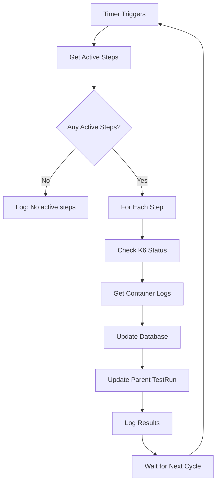

# Periodic K6 Status and Log Sync Implementation

This document describes the automatic periodic synchronization system that updates K6 TestRun step statuses and container logs every 20 seconds.

## Overview

The system provides automatic background synchronization of K6 TestRun steps, updating both their status and container logs from Kubernetes at configurable intervals (default: 20 seconds).

## Key Features

### 🕒 **20-Second Default Interval**
- Automatically syncs every 20 seconds (reduced from previous 60 seconds)
- Configurable via environment variable: `K6_SYNC_INTERVAL_SECONDS`
- Range: 5-300 seconds (5 seconds minimum, 5 minutes maximum)

### 🔄 **Automatic Startup**
- Starts automatically when the application launches
- Controlled by `K6_AUTO_SYNC_ENABLED` environment variable (default: enabled)
- Graceful shutdown handling with SIGTERM/SIGINT signals

### 📊 **Comprehensive Logging**
- Detailed sync cycle logging with timestamps
- Error tracking and reporting
- Performance metrics (duration, affected steps, etc.)

## Configuration

### Environment Variables

```bash
# Sync interval (5-300 seconds, default: 20)
K6_SYNC_INTERVAL_SECONDS=20

# Enable/disable auto-sync (default: true)
K6_AUTO_SYNC_ENABLED=true
```

### Runtime Configuration

The sync job can also be controlled via API endpoints at runtime:

```bash
# Get current sync job status
GET /api/dashboard/load-testing/sync-job

# Start sync job with custom interval
POST /api/dashboard/load-testing/sync-job
{
  "action": "start",
  "intervalSeconds": 15
}

# Restart with default settings
POST /api/dashboard/load-testing/sync-job
{
  "action": "restart"
}

# Stop sync job
POST /api/dashboard/load-testing/sync-job
{
  "action": "stop"
}
```

## Implementation Details

### Core Components

#### 1. Cron Job System (`src/lib/cron-jobs.ts`)

```typescript
// Default 20-second interval with environment override
const getSyncIntervalMs = (): number => {
  const envInterval = process.env.K6_SYNC_INTERVAL_SECONDS
  if (envInterval) {
    const parsed = parseInt(envInterval, 10)
    if (!isNaN(parsed) && parsed >= 5 && parsed <= 300) {
      return parsed * 1000
    }
  }
  return 20000 // 20 seconds default
}
```

#### 2. Automatic Startup (`src/lib/app-startup.ts`)

```typescript
// Auto-starts sync job during application initialization
export function initializeBackgroundJobs() {
  const autoSyncEnabled = process.env.K6_AUTO_SYNC_ENABLED !== 'false'
  
  if (autoSyncEnabled) {
    startK6StepsSyncJob()
    // Logs: "✅ K6 steps auto-sync enabled (every 20 seconds)"
  }
}
```

#### 3. Sync Logic (`src/lib/k6-status-sync.ts`)

Enhanced sync process:
- ✅ Updates step status when K6 TestRun status changes
- ✅ Collects logs from all containers (supports parallelism)
- ✅ Updates logs when status changes OR logs are missing
- ✅ Updates parent TestRun status based on step statuses
- ✅ Comprehensive error handling and logging

## Sync Process Flow



## Monitoring and Logging

### Console Output Example

```
⏰ [2025-01-08T15:30:00.123Z] Starting scheduled K6 steps sync...
✅ [2025-01-08T15:30:01.456Z] K6 steps sync completed: {
  total: 3,
  updated: 2,
  errors: 0,
  logsUpdated: 2,
  duration: "1333ms"
}
📋 [2025-01-08T15:30:01.456Z] Updated logs for 2 steps
```

### Error Handling

```
❌ [2025-01-08T15:30:20.789Z] Steps with errors: [
  {
    step: "Load Test Step",
    k6TestName: "team-scenario-step-123",
    error: "Failed to get K6 test status - 404 not found"
  }
]
```

## API Response Format

### GET /api/dashboard/load-testing/sync-job

```json
{
  "success": true,
  "job": {
    "isRunning": true,
    "intervalMs": 20000,
    "intervalSeconds": 20,
    "nextRunIn": "< 20s",
    "configuredVia": "default (20s)",
    "autoSyncEnabled": true,
    "apiKeyConfigured": false
  },
  "timestamp": "2025-01-08T15:30:00.000Z"
}
```

### POST /api/dashboard/load-testing/sync-job

```json
{
  "success": true,
  "action": "restart",
  "result": "Джоба перезапущена с интервалом 15 секунд",
  "job": {
    "isRunning": true,
    "intervalMs": 15000,
    "intervalSeconds": 15,
    "nextRunIn": "< 15s",
    "configuredVia": "runtime override"
  },
  "timestamp": "2025-01-08T15:30:00.000Z"
}
```

## Performance Impact

### Resource Usage
- **Memory**: Minimal - uses single timer with callbacks
- **CPU**: Light - only active during sync operations
- **Network**: Proportional to number of active test runs
- **Database**: Optimized with batch updates

### Scalability Considerations
- ✅ Handles multiple parallel K6 tests efficiently
- ✅ No impact on application response time
- ✅ Graceful handling of Kubernetes API timeouts
- ✅ Database operations are atomic and optimized

## Testing

### Test Script
Run the test script to verify functionality:

```bash
node test-20s-sync.js
```

The test will:
1. ✅ Verify default 20-second interval
2. ✅ Test custom interval configuration
3. ✅ Monitor multiple sync cycles
4. ✅ Validate environment variable handling
5. ✅ Test start/stop functionality

### Manual Testing

```bash
# Start the application with custom interval
K6_SYNC_INTERVAL_SECONDS=10 npm run dev

# Check sync job status
curl -X GET http://localhost:3000/api/dashboard/load-testing/sync-job

# Restart with different interval
curl -X POST http://localhost:3000/api/dashboard/load-testing/sync-job \
  -H "Content-Type: application/json" \
  -d '{"action": "restart", "intervalSeconds": 15}'
```

## Migration Notes

### Changes from Previous Version
- ✅ **Reduced default interval**: 60s → 20s
- ✅ **Added environment configuration**: `K6_SYNC_INTERVAL_SECONDS`
- ✅ **Enhanced API control**: Runtime interval modification
- ✅ **Improved logging**: More detailed sync cycle information
- ✅ **Better error handling**: Individual step error tracking

### Backward Compatibility
- ✅ **Fully compatible**: Existing deployments will use 20s automatically
- ✅ **Environment override**: Can revert to 60s with `K6_SYNC_INTERVAL_SECONDS=60`
- ✅ **API unchanged**: Existing API endpoints remain functional

## Troubleshooting

### Common Issues

1. **Sync not starting**
   ```bash
   # Check if auto-sync is enabled
   echo $K6_AUTO_SYNC_ENABLED
   
   # Manually start via API
   curl -X POST .../sync-job -d '{"action":"start"}'
   ```

2. **Too frequent syncing**
   ```bash
   # Increase interval
   K6_SYNC_INTERVAL_SECONDS=60 npm run dev
   ```

3. **No logs updating**
   ```bash
   # Check Kubernetes connectivity
   kubectl get pods -n k6-runs
   
   # Verify API permissions
   kubectl auth can-i get pods --namespace=k6-runs
   ```

### Debug Mode

Enable detailed logging by monitoring console output during sync cycles:

```bash
# The sync process logs every operation with timestamps
tail -f application.log | grep "K6 steps sync"
```

## Security Considerations

- ✅ **API Access**: Requires organizer role for all sync job management
- ✅ **Resource Limits**: Interval capped at 5-300 seconds to prevent abuse
- ✅ **Error Containment**: Individual sync failures don't stop the entire process
- ✅ **Graceful Shutdown**: Proper cleanup on application termination