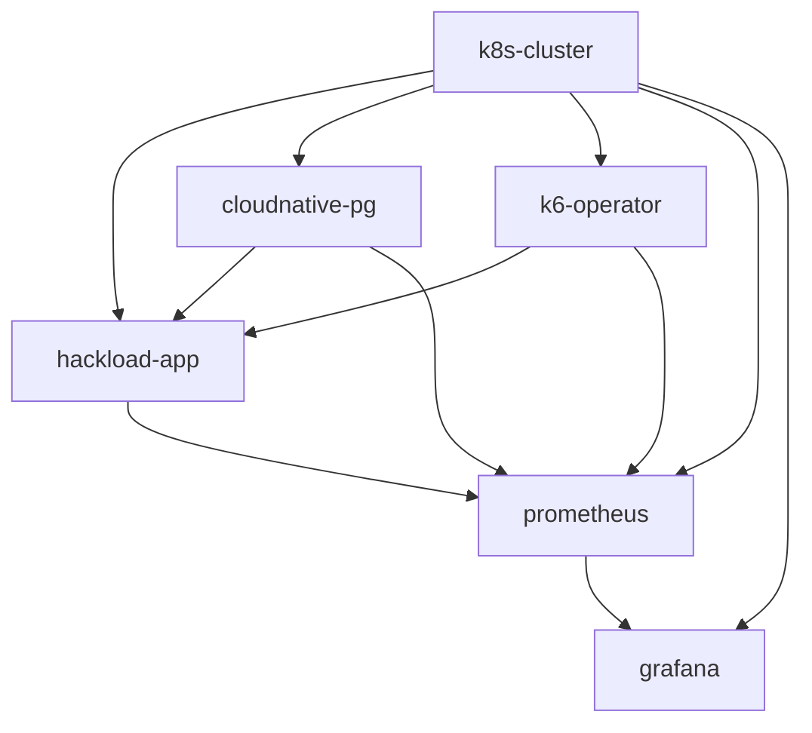

# Обзор Terraform модулей

Этот документ предоставляет общий обзор всех Terraform модулей для инфраструктуры HackLoad 2025.

## Архитектура модулей

```
┌─────────────────────────────────────────────────────────────────┐
│                         K8s Кластер                            │
│  ┌─────────────────┐  ┌─────────────────┐  ┌─────────────────┐  │
│  │ HackLoad Приложение │  │  CloudNativePG  │  │   Мониторинг    │  │
│  │                 │  │                 │  │                 │  │
│  │  - REST API     │  │  - PostgreSQL   │  │  - Prometheus   │  │
│  │  - Управление   │  │  - Backup/HA    │  │  - Grafana      │  │
│  │    командами    │  │  - Мониторинг   │  │  - Дашборды     │  │
│  └─────────────────┘  └─────────────────┘  └─────────────────┘  │
│           │                      │                      │       │
│           └──────────────────────┼──────────────────────┘       │
│                                  │                              │
│  ┌─────────────────────────────────────────────────────────────┐  │
│  │                    K6 Оператор                             │  │
│  │                                                             │  │
│  │  - Выполнение нагрузочных тестов                           │  │
│  │  - Распределенное тестирование                             │  │
│  │  - Сбор метрик                                             │  │
│  └─────────────────────────────────────────────────────────────┘  │
└─────────────────────────────────────────────────────────────────┘
```

## Зависимости модулей



## Краткое описание модулей

### 1. K8s Кластер (`src/modules/k8s-cluster/`)

**Назначение**: Базовая инфраструктура Kubernetes кластера

- **Ресурсы**: EKS/GKE/AKS кластер, VPC, группы узлов
- **Возможности**: Автомасштабирование, группы безопасности, RBAC
- **Зависимости**: Нет (базовый модуль)

### 2. HackLoad Приложение (`src/modules/hackload-app/`)

**Назначение**: Основное приложение для управления нагрузочными тестами и командами

- **Ресурсы**: Deployment, service, ingress, configmaps
- **Возможности**: REST API, управление командами, оркестрация тестов
- **Зависимости**: k8s-cluster, cloudnative-pg

### 3. CloudNativePG (`src/modules/cloudnative-pg/`)

**Назначение**: База данных PostgreSQL с высокой доступностью

- **Ресурсы**: PostgreSQL кластер, резервные копии, мониторинг
- **Возможности**: HA, автоматические бэкапы, пул соединений
- **Зависимости**: k8s-cluster

### 4. K6 Оператор (`src/modules/k6-operator/`)

**Назначение**: Kubernetes-нативное нагрузочное тестирование с K6

- **Ресурсы**: Deployment оператора, CRD, RBAC
- **Возможности**: Распределенные тесты, автомасштабирование, метрики
- **Зависимости**: k8s-cluster

### 5. Prometheus (`src/modules/prometheus/`)

**Назначение**: Сбор метрик и мониторинг

- **Ресурсы**: StatefulSet, обнаружение сервисов, алертинг
- **Возможности**: Мониторинг множественных целей, федерация, алерты
- **Зависимости**: k8s-cluster

### 6. Grafana (`src/modules/grafana/`)

**Назначение**: Визуализация и дашборды

- **Ресурсы**: Deployment, дашборды, источники данных
- **Возможности**: Кастомные дашборды, алертинг, многопользовательский режим
- **Зависимости**: k8s-cluster, prometheus

## Требования к ресурсам

### Окружение разработки

| Модуль | Запрос CPU | Запрос памяти | Хранилище |
|--------|------------|---------------|-----------|
| k8s-cluster | 2 vCPU | 4 GB | - |
| hackload-app | 100m | 128Mi | - |
| cloudnative-pg | 250m | 512Mi | 20Gi |
| k6-operator | 100m | 128Mi | - |
| prometheus | 250m | 1Gi | 50Gi |
| grafana | 100m | 128Mi | 5Gi |
| **Итого** | ~3 vCPU | ~6 GB | 75Gi |

### Продакшн окружение

| Модуль | Запрос CPU | Запрос памяти | Хранилище |
|--------|------------|---------------|-----------|
| k8s-cluster | 6 vCPU | 12 GB | - |
| hackload-app | 500m | 512Mi | - |
| cloudnative-pg | 1000m | 4Gi | 200Gi |
| k6-operator | 200m | 256Mi | 10Gi |
| prometheus | 1000m | 4Gi | 200Gi |
| grafana | 200m | 512Mi | 20Gi |
| **Итого** | ~9 vCPU | ~22 GB | 430Gi |

## Соображения безопасности

### Сетевая безопасность

- **Сетевые политики**: Все модули включают изоляцию сети
- **TLS**: Зашифрованное общение между сервисами
- **Ingress**: Контролируемые точки внешнего доступа

### Аутентификация и авторизация

- **RBAC**: Ролевое управление доступом Kubernetes
- **Секреты**: Безопасное управление учетными данными
- **Сервисные аккаунты**: Принцип минимальных привилегий

### Защита данных

- **Шифрование**: Шифрование в покое и при передаче
- **Резервные копии**: Автоматизированные стратегии резервного копирования
- **Контроль доступа**: Безопасность базы данных и приложений

## Стратегия мониторинга

### Сбор метрик

- **Метрики приложений**: Пользовательские бизнес-метрики
- **Метрики инфраструктуры**: Метрики Kubernetes и узлов
- **Метрики нагрузочных тестов**: Данные производительности K6
- **Метрики базы данных**: Производительность PostgreSQL

### Дашборды

- **Обзор**: Общий статус хакатона
- **Производительность**: Анализ по командам
- **Инфраструктура**: Состояние системы и пропускная способность
- **Реальное время**: Выполнение тестов в реальном времени

### Оповещения

- **Производительность**: Оповещения о времени отклика и частоте ошибок
- **Инфраструктура**: Оповещения об использовании ресурсов
- **Приложения**: Оповещения о доступности сервисов

## Рабочий процесс развертывания

### Прогресс по окружениям

1. **Разработка**: Тестирование одним разработчиком
2. **Staging**: Интеграционное тестирование с фиктивными командами
3. **Продакшн**: Среда для живого хакатона

### Этапы развертывания

1. Развернуть модуль `k8s-cluster`
2. Развернуть модуль `cloudnative-pg`
3. Развернуть модули `prometheus` и `grafana`
4. Развернуть модуль `k6-operator`
5. Развернуть модуль `hackload-app`
6. Проверить все интеграции

### Стратегия отката

- **База данных**: Доступно восстановление на момент времени
- **Приложения**: Градуальные развертывания с проверками работоспособности
- **Конфигурация**: Управление конфигурацией на основе Git

## Оптимизация затрат

### Автомасштабирование

- **Кластер**: Автомасштабирование узлов на основе спроса
- **Приложения**: HPA для переменных рабочих нагрузок
- **Нагрузочное тестирование**: Масштабирование до нуля при отсутствии тестирования

### Управление ресурсами

- **Запросы/Лимиты**: Правильное распределение ресурсов
- **Хранилище**: Подходящие классы хранения и удержание
- **Сети**: Эффективный ingress и балансировка нагрузки

### Размер окружений

- **Разработка**: Минимальное распределение ресурсов
- **Staging**: Подобно продакшну, но в меньшем масштабе
- **Продакшн**: Полное распределение ресурсов для 40 команд

## Руководство по устранению неполадок

### Распространенные проблемы

1. **Зависимости модулей**: Убедитесь в правильном порядке развертывания
2. **Ограничения ресурсов**: Проверьте пропускную способность кластера
3. **Сетевая связность**: Проверьте обнаружение сервисов
4. **Проблемы с хранилищем**: Проверьте PVC и классы хранения

### Инструменты мониторинга

- **Kubernetes Dashboard**: Обзор кластера
- **Prometheus UI**: Исследование метрик
- **Grafana Dashboards**: Визуальный мониторинг
- **kubectl**: Устранение неполадок из командной строки

### Агрегация логов

- **Логи приложений**: Структурированное логирование JSON
- **Логи инфраструктуры**: Логи узлов и подов
- **Логи аудита**: Журнал аудита API Kubernetes

## Будущие улучшения

### Потенциальные дополнения

- **Service Mesh**: Istio для продвинутого управления трафиком
- **GitOps**: ArgoCD для непрерывного развертывания
- **Решения резервного копирования**: Velero для резервного копирования кластера
- **Мониторинг затрат**: Распределение и отслеживание затрат

### Улучшения масштабируемости

- **Мульти-кластер**: Федерация между регионами
- **Продвинутое планирование**: Пользовательские планировщики для нагрузочного тестирования
- **Квоты ресурсов**: Управление ресурсами на основе пространств имен

Эта модульная архитектура обеспечивает масштабируемость, поддерживаемость и четкое разделение ответственности для инфраструктуры HackLoad 2025.
